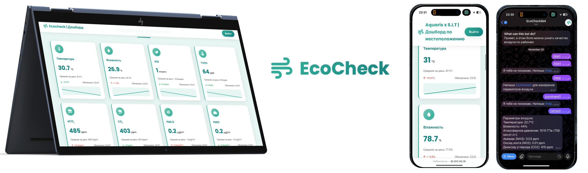

# EcoCheck Library
[RU README](READMERU.md) | [EN README](README.md)



A library for ESP8266 for sending sensor data to the server. Supports automatic and manual data sending, working with WiFi through an access point for configuration. 

To display data from the sensor, we recommend using our convenient [service](http://82.202.142.35:8080)

The project on which the library is based, as well as the old [service sources](https://github.com/ArduRadioKot/AquariusEcoCase)

## Features

- Automatic sending of data to the server at a configurable interval
- Manual sending of data on demand
- Support for standard sensors (temperature, humidity, AQI, CO, dust, UV, etc.)
- WiFi configuration via web interface (access point)
- Saving WiFi configuration in EEPROM
- Automatic reconnection in case of loss of connection
- Configurable server settings (IP and port)

## Installation

1. Copy the `ecoCheck` folder to the `libraries` folder of your Arduino project or to the standard folder of Arduino IDE libraries
2. Open the Arduino IDE
3. Select an example from the menu: `File -> Examples -> ecoCheck`

## Quick start

```cpp
#include <ecoCheck.h>

// Server settings
const char* SERVER_IP = "82.202.142.35";
const int SERVER_PORT = 8080;
const char* DEVICE_ID = "esp01";

// Creating an instance of the library
EcoCheck ecoCheck(SERVER_IP, SERVER_PORT, DEVICE_ID);

void setup() {
  ecoCheck.begin();
  ecoCheck.setAutoSend(true, 10000); // Auto-send every 10 seconds
}

void loop() {
  ecoCheck.loop();

// Installing sensor data
  ecoCheck.setTemperature(23.5);
  ecoCheck.setHumidity(55.0);
  ecoCheck.setAQI(50);
  
  delay(5000);
}
```

## API Documentation

### Constructor

```cpp
EcoCheck(const char* serverIP, int serverPort, const char* deviceID = "esp01")
```

Creates an instance of the library with the server's IP address and port specified.

**Parameters:**
- `serverIP' - Server IP address (for example, "192.168.1.100")
- `ServerPort' - Server port (for example, 8080)
- `DeviceID' - Device identifier (default is "esp01")

### Initialization

```cpp
void begin()
```

Initializes the library, downloads the WiFi configuration from the EEPROM, and connects to the network or launches an access point for configuration.

### Main cycle

```cpp
void loop()
```

**Must** be called in the `loop()` function of your sketch. Handles WiFi connection and automatic data sending.

### Standard sensors

The library supports the following standard functions for installing sensor data:

```cpp
void setTemperature(float value); // Temperature (°C)
void setHumidity(float value); // Humidity (%)
void setAQI(int value); // Air quality index
void setTVOC(float value);              // TVOC (ppb)
void setECO2(float value);              // eCO2 (ppm)
void setCO(float value);                // CO (ppm)
void setAlcohol(float value);           // Alcohol (ppm)
void setCO2(float value);               // CO2 (ppm)
void setToluene(float value);           // Toluene (ppm)
void setAmmonia(float value);           // Ammonia (ppm)
void setAcetone(float value);           // Acetone (ppm)
void setPM25(float value);              // PM2.5 (µg/m³)
void setPM10(float value);              // PM10 (µg/m³)
void setDustDensity(float value); // Dust density (µg/m3)
void setUVIndex(float value); // UV index
```

### Sending data

```cpp
// Manual data sending
bool sendData();

// Setting up automatic sending
void setAutoSend(bool enabled, unsigned long interval = 10000);
```

**Examples:**

```cpp
// Disable automatic sending
ecoCheck.setAutoSend(false);

// Enable automatic sending every 5 seconds
ecoCheck.setAutoSend(true, 5000);

// Manually sending data
if (someCondition) {
  ecoCheck.sendData();
}
```

### WiFi functions

```cpp
// Checking the WiFi connection
bool isWiFiConnected();

// Getting a local IP address
IPAddress getLocalIP();

// Reset WiFi configuration
void resetWiFiConfig();

// Setting the access point name
void setAPName(const char* apSSID, const char* apPassword = "12345678");
```

## Usage examples

### Example 1: Basic Usage

See `examples/BasicExample/BasicExample.ino`

### Example 2: Manual sending

See `examples/ManualSend/ManualSend.ino`

### Example 3: Full example

See `examples/FullExample/FullExample.ino`

## WiFi Configuration

At the first launch, the device will create an access point.:

- **SSID:** `ESP8266_Config' (can be changed via `setAPName()')
- **Password:** `12345678' (can be changed via `setAPName()')

1. Connect to the access point
2. Open the browser and go to `192.168.4.1`
3. Enter the SSID and password of your WiFi network
4. Click "Save & Connect"
5. The device will reboot and connect to WiFi

The configuration is saved in the EEPROM and loaded at the next startup.

## The format of the data on the server

The library sends a POST request to `/data` with data in the `application/x-www-form-urlencoded` format.

**Important:** Only the parameters that you have explicitly set** are sent to the server via the 'set*()` function. If you have not called, for example, `setTemperature()`, then the `temperature` parameter will not be included in the request.

Request example (if only temperature, humidity, and AQI are set):

```
device=esp01
status=online
free_memory=12345
temperature=23.5
humidity=55.0
aqi=50
```

If all the parameters are set:

```
device=esp01
status=online
free_memory=12345
temperature=23.5
humidity=55.0
aqi=50
tvoc=100
eco2=400
co=0.5
pm25=15.2
uv_index=3.5
...
```


## Requirements

- ESP8266 (NodeMCU, Wemos D1 Mini, etc.)
- Arduino IDE with ESP8266 support
- WiFi network to connect to

## License

Free use in personal and commercial projects.

## Support

If you encounter problems, check:
1. The server's IP address and port are correct
2. Connect to a WiFi network
3. Server availability from the network
4. Serial monitor for debugging information